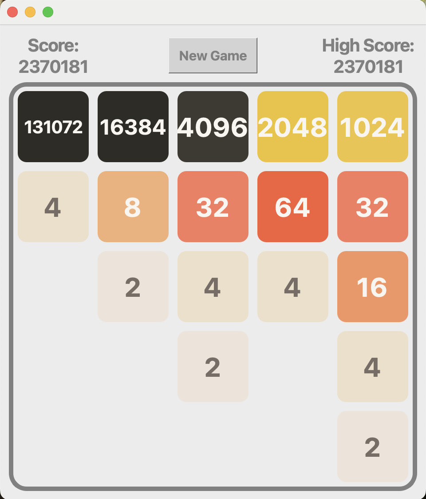

# Qt-2048
This is a clone of [2048](https://github.com/gabrielecirulli/2048) written in C++ using QT.

## Features 

* Board sizes from 2x2 to 6x6. 

* Been tested on macOS and an Xfce Linux desktop;
should work on any desktop envorment supported by Qt.

* May not look great on high DPI monitors; 
improved high DPI monitor support.

* Mobile support may be added in the future.

## Screenshot 



A screenshot showing the aperance on macOS.

## Build Instructions

### Prerequisites

* A C++ compiler

* Qt (installed with development files)

* CMake 

### Build

Clone the repository and configure a build directory:

```sh
git clone https://github.com/thomasbouley/Qt-2048
cd Qt-2048
cmake -S ./ -B build/
```

Compile with

```
cmake --build build/
```
* Linux: produces an executable in the `build` directory.

* macOS: produces an application bundle `2048.app` in the `build` directory.

### Run

* Linux: `./build/2048`

* macOS: `open build/2048.app`

The executable or app bundled may be moved as desire to install them.   

## Contributing
This project was created for my own education,
but bug reports, suggestions,and improvements are welcome. 
Feel free to fork and open a pull request.

## License

Licensed under the [MIT](LICENSE.txt) License. 

